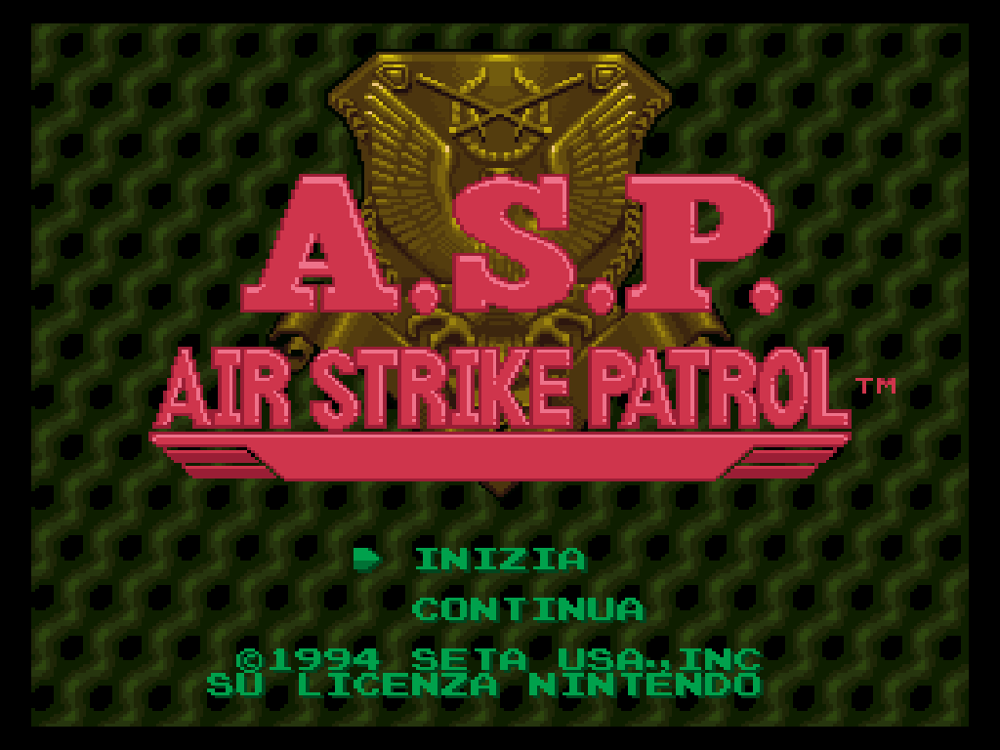

# A.S.P. — Air Strike Patrol (SNES): traduzione italiana + recompilazione nativa



Il progetto è diviso in due parti:

1. **Traduzione italiana** della ROM SNES *A.S.P. – Air Strike Patrol (USA)*: testo compresso, stringhe in chiaro, grafica disegnata e titoli di coda. La distribuzione è una patch IPS.
2. **Recompilazione statica** del gioco già tradotto, fatta con [snesrecomp](https://github.com/RetroPortingToolKit/snesrecomp) e con il launcher/menu in-game [recomp-ui](https://github.com/mstan/recomp-ui). Il risultato è un eseguibile nativo per Windows, Linux e macOS.

> **La ROM non è inclusa.** Serve una copia legittima del gioco originale. In questa repo non c'è nessun dato della ROM: anche il C generato dal recompilatore (`src/gen/`) resta fuori da git.

## Stato

| Parte | Stato |
|---|---|
| Traduzione | v7. `translation/patches/ASP_ITA.ips` ricrea esattamente la ROM italiana di riferimento (CRC32 `7d4c26e3`) |
| Recomp | Lo scaffolding è fatto, la generazione del C e la compilazione funzionano, l'eseguibile arriva alla schermata del titolo in italiano. Il port è in modalità *LLE-first*: quasi tutto il codice è ancora interpretato e va promosso ad AOT funzione per funzione (vedi sotto) |

## 1. Creare la ROM italiana

```sh
mkdir rom
python tools/apply_ips.py "percorso/A.S.P. - Air Strike Patrol (USA).sfc" translation/patches/ASP_ITA.ips rom/ASP_ITA.sfc --crc 7d4c26e3
```

ROM originale attesa: CRC32 `05c0da54`, SHA-256 `69c5805a…b7f9`. La cartella `rom/` è ignorata da git.

## 2. Compilare la recomp

Requisiti: Python 3.9+, Rust (la versione è fissata da `snesrecomp/rust-toolchain.toml`), CMake, Ninja oppure MSVC, Git. Su Windows conviene Git Bash per eseguire `tools/regen.sh`.

```sh
git clone --recursive https://github.com/SirL0LL0/A.S.P._SNES_Recomp
cd A.S.P._SNES_Recomp
bash tools/regen.sh --rom rom/ASP_ITA.sfc          # verifica la ROM e genera src/gen/*.c
cmake -S . -B build -DCMAKE_BUILD_TYPE=Release
cmake --build build -j
./build/ASPAirStrikePatrolItaSNESRecomp            # si apre il launcher recomp-ui
```

`regen.sh` rifiuta qualsiasi ROM con digest diverso da quelli in `rom_identity.txt`. Ogni volta che la traduzione cambia, bisogna aggiornare quel file con i nuovi digest e rigenerare.

## Struttura

| Percorso | Contenuto |
|---|---|
| `translation/` | progetti `.json`, `correzioni.json`, patch IPS, testo sorgente, revisione |
| `tools/` | `asp_core.py` (compressore e iniettore), `asp_import.py`, tool grafico v7, `apply_ips.py`, `regen.sh` |
| `scripts/` | script di estrazione e scansione usati durante la ricerca |
| `emulator/` | sorgenti di `asp_run` (emulatore senza finestra per il tracciamento) |
| `examples/` | scenari di input e riferimenti |
| `docs/` | note tecniche e tabelle verificate. `RECOMP_SCAFFOLD_README.md` è la guida originale di snesrecomp |
| `recomp/` | input dell'analisi: `bank*.cfg`, `symbols.toml` |
| `src/` | codice host specifico del gioco: `main.c`, `game_rtl.c`. `src/gen/` viene generato e non va in git |
| `rom_identity.txt` | digest della ROM italiana, letti da build, regen e CI |
| `snesrecomp/`, `recomp-ui/` | submodule del framework, fissati ai commit elencati in `framework_pins.txt` |

## Prossimi passi della recomp

1. Individuare il main loop e l'NMI di A.S.P. (reset `$8100`, NMI `$82D5`) e sistemare il frame driver in `src/game_rtl.c`.
2. Dare un nome alle routine in `recomp/symbols.toml` e promuoverle ad AOT con `emit = true`, poi rilanciare `tools/regen.sh`.
3. Risolvere i *dispatch miss*, cioè i salti indiretti non risolti, dopo ogni esecuzione.
4. Non modificare mai `src/gen/` a mano.

## Licenza

Il codice originale di questo progetto è sotto PolyForm Noncommercial 1.0.0 (`LICENSE`), che è anche la licenza di snesrecomp: **niente uso commerciale**. I framework hanno le proprie condizioni, riportate in `snesrecomp/LICENSE`, `snesrecomp/THIRD_PARTY_ATTRIBUTION.md` e `recomp-ui/LICENSE` (MIT). Nessuna di queste licenze copre i dati del gioco, che restano di SETA.
